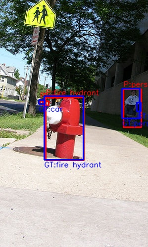

# Instruction-based Object Detection using Multimodal Foundation Models

This is the repo for my EECE-570 project, demonstrating how to fine-tune the **Qwen2-VL-2B-Instruct** model for object detection.

---

## Overview

- Base Model: Qwen2-VL-2B-Instruct (https://huggingface.co/Qwen/Qwen2-VL-2B-Instruct)
- Fine-tuning: Swift Architecture with LoRA and Instruction Tuning (https://github.com/modelscope/ms-swift)
- Evaluation: Precision@50, Recall@50, F1-score, Mean IoU@50
- Contribution: Instruction-level augmentations to improve spatial and quantitative reasoning
---

## Environment

```bash
OS: Windows 11 Pro  
GPU: NVIDIA GeForce RTX 4070 (12GB VRAM)  
CPU: Intel Core i7-13700  
RAM: 32GB DDR5  
Python: 3.10.16  
PyTorch: 2.1.0 + CUDA 12.8  
Transformers: 4.49.0  
LoRA Framework: Swift SFT (ms-swift 3.3.0.dev0)  
Other Packages: qwen-vl-utils==0.0.10, opencv-python, tqdm, json
```

All experiments were conducted on a single machine using consumer-grade hardware.

---

## Demo
https://www.youtube.com/watch?v=Xa2Ky-XgKpo

---
## Step 1: Data Preparation

Data are downloaded from https://cocodataset.org/#download

### Data Preprocessing

The data preprocessing pipeline includes three main steps. All scripts are located in the [`/data_preprocess`](./data_preprocess).

#### Steps Overview:

Step1.py: **Subset COCO Images and Annotations**  
   - **Input**: `instances_train2017.json` + the `train2017/` image folder  
   - **Output**: A smaller COCO subset for faster training and experimentation.

Step2.py: **Convert to Detection Format**  
   - **Input**: Subset annotations  
   - **Output**: A JSON file with image paths and per-class bounding boxes:
     ```json
     {
       "image_path": "xxx.jpg",
       "object": {
         "person": [[x1, y1, x2, y2]],
         "car": [[x1, y1, x2, y2]]
       }
     }
     ```

Step3.py: **Construct Instruction-Following Multimodal Format**  
   - **Input**: The above JSON with object annotations  
   - **Output**: A multimodal instruction-style dataset for fine-tuning:
     ```json
     {
       "messages": [
         {"role": "user", "content": "<image>Draw the bounding box of objects"},
         {"role": "assistant", "content": "<|object_ref_start|>person<|object_ref_end|><|box_start|>(x1,y1),(x2,y2)<|box_end|>"}
       ],
       "images": ["xxx.jpg"]
     }
     ```
📌 These outputs serve as direct training inputs for the fine-tuning stage. It can also be used for test dataset for evaluation.

---

## Step 2: Model Training

I use the `swift` training CLI with LoRA.

### Training Config (stored in `run.bash`)

```bash
#!/bin/bash
CUDA_VISIBLE_DEVICES=0 swift sft \
  --train_type lora \
  --model 'Qwen2-VL-2B-Instruct' \
  --dataset 'coco_final_train.json' \
  --lora_rank 32 \
  --lora_alpha 64 \
  --freeze_vit false \
  --freeze_aligner false \
  --freeze_llm false \
  --per_device_train_batch_size 1 \
  --gradient_accumulation_steps 4 \
  --num_train_epochs 10 \
  --learning_rate 5e-5 \
  --output_dir 'output/' \
  --torch_dtype bfloat16 \
  --split_dataset_ratio 0.0 \
  --dataset_num_proc 1 \
  --lazy_tokenize true \
  --target_modules "all-linear" \
  --save_steps 500 \
  --logging_steps 5 \
  --max_length 2048 \
  --lr_scheduler_type cosine \
  --warmup_ratio 0.05 \
  --dataloader_num_workers 0 \
  --add_version
```

### Explanation

- **LoRA Parameters:** I tried different settings to allow expressive adapter layers in the experiments.
- **Freezing:** All components (`ViT`, `Aligner`, and LLM) are unfrozen. I set Vit and Aligner frozen or unfrozen in my experiments.

### How to Run

To start training, run the following:

```bash
bash run.sh
```

---

## Step 3: Instruction-Level Augmentation

To improve the model’s perception ability, I designed two main types of instruction-level augmentations: **quantity-oriented** and **spatial-oriented**.  
All augmentation scripts are located in `/improvement/augmentation/`, and the generated training samples are stored in [`./improvement/samples/`](./improvement/samples/).

### 🔢 Quantity-based Augmentation

This focuses on helping the model better understand **how many objects** of each category exist in the image.

- **Prompt:**
  ```
  <image> Please count how many objects of each category are in the image.
  ```

- **Response:**
  ```
  person: 2
  bicycle: 1
  motorcycle: 1
  ```

- Code: [`./improvement/augmentation/count.py`](./improvement/augmentation/count.py)  
- Output: [`./improvement/samples/count.json`]{./improvement/samples/count.json)

---

### 📐 Spatial-Oriented Augmentation

This focuses on enhancing the model’s understanding of **where** objects are and how they are framed in the image. It includes three sub-types:

#### 1. Fully Enclosed Region
- **Goal:** Simulate ideal bounding box cases where an object is completely enclosed.

- **Prompt:**
  ```
  Please check the area <|box_start|>(x1,y1),(x2,y2)<|box_end|> and describe if it fully contains any object from the COCO categories.
  ```

- **Response:**
  ```
  The area <|box_start|>(x1,y1),(x2,y2)<|box_end|> fully contains a "bicycle".
  ```
- Code: [`./improvement/augmentation/fully-overlapped.py`](./improvement/augmentation/fully-overlapped.py)  
- Output: [`./improvement/samples/fully-overlapped.json`]{./improvement/samples/fully-overlapped.json)

#### 2. Partially Overlapped Region
- **Goal:** Simulate cases where objects are occluded or cropped.

- **Prompt:**
  ```
  Please check the area <|box_start|>(x1,y1),(x2,y2)<|box_end|> and describe the category and degree of inclusion.
  ```

- **Response:**
  ```
  The area <|box_start|>(x1,y1),(x2,y2)<|box_end|> partially contains a "person", about 60% is visible.
  ```
- Code: [`./improvement/augmentation/partial-overlapped.py`](./improvement/augmentation/partial-overlapped.py)  
- Output: [`./improvement/samples/partial-overlapped.json`]{./improvement/samples/partial-overlapped.json)

#### 3. Non-Overlapping Region
- **Goal:** Simulate empty or irrelevant regions as negative samples.

- **Prompt:**
  ```
  Please check the area <|box_start|>(x1,y1),(x2,y2)<|box_end|> and determine if any object is present.
  ```

- **Response:**
  ```
  The area <|box_start|>(x1,y1),(x2,y2)<|box_end|> does not contain any object from the COCO categories.
  ```
- Code: [`./improvement/augmentation/non-overlapping.py`](./improvement/augmentation/non-overlapping.py)  
- Output: [`./improvement/samples/non-overlapping.json`]{./improvement/samples/non-overlapping.json)

---

## Step 4: Inference

### Model Merge

```bash
bash examples/exports/merge_lora.sh
```

### Inference Format

Raw output:
```
person(531,61),(771,896)
```

Parsed output:
```json
{
  "person": [[531, 61, 771, 896]]
}
```

- Inference Code: [`./improvement/inference.py`](./improvement/inference.py)

### Evaluation Metrics

- Precision@50
- Recall@50
- F1-score@50
- Mean IoU@50
  
Evaluated using IoU ≥ 0.5 and class match.

- Evaluation Code: [`./improvement/evaluation.py`](./improvement/evaluation.py)

### Visualization Example

- Visualization Code: [`./improvement/visualization_for_infer.py`](./improvement/visualization_for_infer.py)
---
## Conclusion

This project presents a practical attempt at adapting a large multimodal model (Qwen2VL-2B) for structured object detection via instruction tuning. Although the training dataset was relatively small and the computation was limited to a single GPU, the model still achieved measurable improvements through LoRA fine-tuning and instruction-level augmentations. This indicates that with carefully designed prompts and lightweight adaptation methods, even resource-constrained setups can benefit from large vision-language models.
